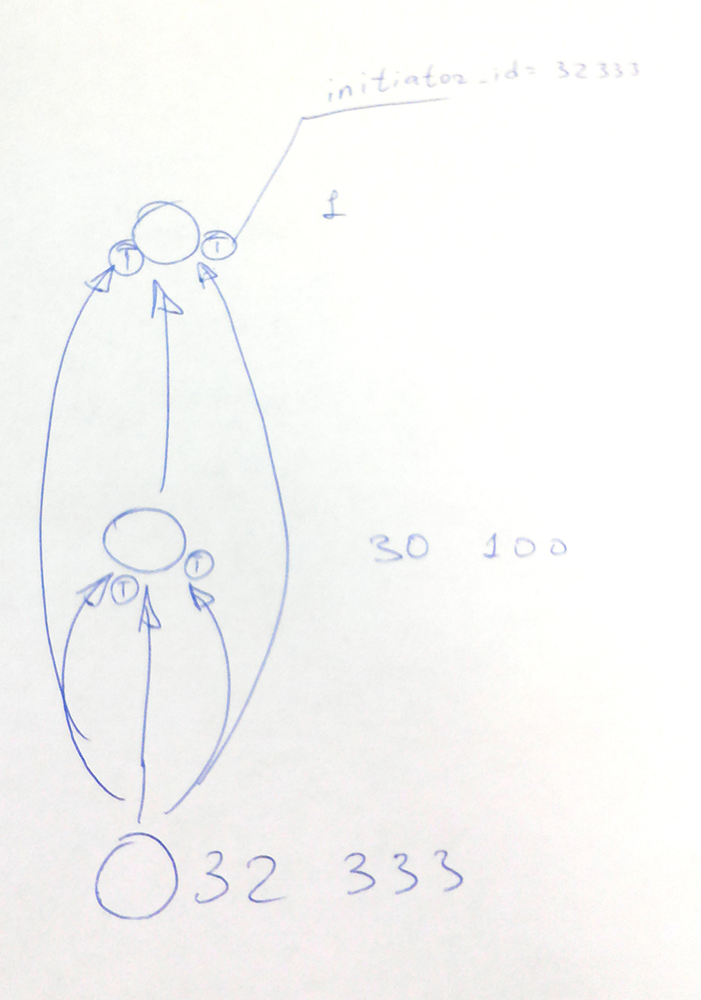
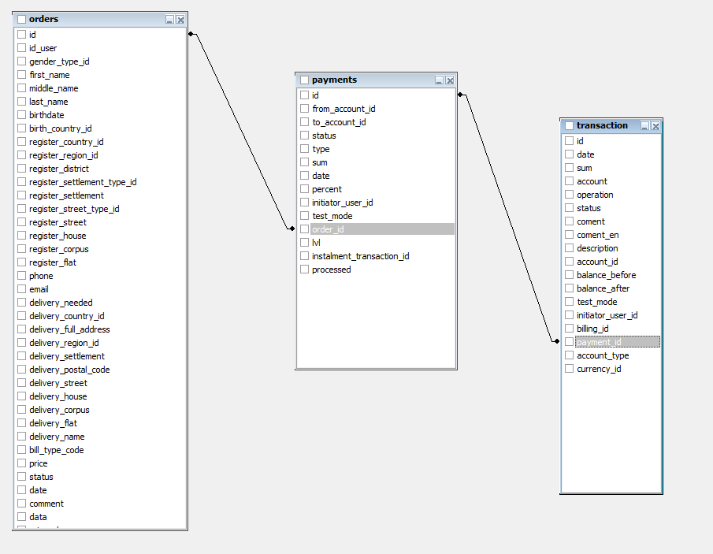

Бизнес Логика
=============

# Терминология

- Цикл Сделки - длина промежутка времени между событием регистрации и первой покупки.
- Покупка - покупка пакета акций сразу или часть оплаты за рассрочку.

- *Кошелек* - счет пользователя. Может быть A B C D. Кошелек A,B,C исчисляется в долларах а кошелек D в шт (акциях).
- *Транза́кция* (англ. transaction, от лат. transactio — соглашение, договор) — минимальная логически осмысленная операция,
которая имеет смысл и может быть совершена только полностью. (Википедия)
Для нашей системы это перевод из одного кошелька в другой, то есть совокупность операций списания с одного или
нескольких кошельков и операций начисления на другой кошелек.
- *Операция* - операция снятия с кошелька или начисления на кошелек.


# Кошельки

Существует четыре типа кошельков
1. A - вычисляется в $
1. B - вычисляется в $
1. C - вычисляется в $
1. D - вычисляется в шт

# Бизнес процесс "Покупка пакета"

Осуществить покупку можно с использованием кошельков A B C и прямо с платежной системы.

Например рассмотрим заказ (order) 42380.

Покупку совершил пользователь 32333.

### Структура

Указаны идентификаторы пользователей.

1. 32333
1. 30100
1. 1

### Заказ

<table border="1" style="border-collapse:collapse">
    <tr>
        <th>id</th>
        <th>id_user</th>
        <th>gender_type_id</th>
        <th>first_name</th>
        <th>middle_name</th>
        <th>last_name</th>
        <th>birthdate</th>
        <th>birth_country_id</th>
        <th>register_country_id</th>
        <th>register_region_id</th>
        <th>register_district</th>
        <th>register_settlement_type_id</th>
        <th>register_settlement</th>
        <th>register_street_type_id</th>
        <th>register_street</th>
        <th>register_house</th>
        <th>register_corpus</th>
        <th>register_flat</th>
        <th>phone</th>
        <th>email</th>
        <th>delivery_needed</th>
        <th>delivery_country_id</th>
        <th>delivery_full_address</th>
        <th>delivery_region_id</th>
        <th>delivery_settlement</th>
        <th>delivery_postal_code</th>
        <th>delivery_street</th>
        <th>delivery_house</th>
        <th>delivery_corpus</th>
        <th>delivery_flat</th>
        <th>delivery_name</th>
        <th>bill_type_code</th>
        <th>price</th>
        <th>status</th>
        <th>date</th>
        <th>comment</th>
        <th>data</th>
        <th>price_gbp</th>
        <th>brandshop_json</th>
        <th>actions_qnt</th>
        <th>price_currency_id</th>
        <th>price_in_price_list</th>
        <th>price_in_price_list_currency_id</th>
        <th>instalment</th>
        <th>payments_left</th>
        <th>deleted_by</th>
    </tr>
    <tr>
        <td>42380</td>
        <td>32333</td>
        <td>0</td>
        <td>Елена</td>
        <td>NULL</td>
        <td>Боркунова</td>
        <td>NULL</td>
        <td>0</td>
        <td>0</td>
        <td>NULL</td>
        <td>NULL</td>
        <td>0</td>
        <td></td>
        <td>NULL</td>
        <td>NULL</td>
        <td>NULL</td>
        <td>NULL</td>
        <td>NULL</td>
        <td>79038032303</td>
        <td>ele-borkunova@yandex.ru</td>
        <td>0</td>
        <td>0</td>
        <td>NULL</td>
        <td>NULL</td>
        <td></td>
        <td></td>
        <td></td>
        <td></td>
        <td>NULL</td>
        <td>NULL</td>
        <td></td>
        <td>A</td>
        <td>16000.00</td>
        <td>1</td>
        <td>2016-04-30 12:58:35</td>
        <td>NULL</td>
        <td></td>
        <td>0.00</td>
        <td></td>
        <td>150000</td>
        <td>2</td>
        <td>250.0000</td>
        <td>3</td>
        <td>1</td>
        <td>9</td>
        <td>0</td>
    </tr>
</table>

### Оплата

```sql
SELECT transaction.*
FROM
  billing
  INNER JOIN transaction ON (billing.id = transaction.billing_id)
  INNER JOIN orders ON (billing.order_id = orders.id)
WHERE
  orders.id = 42380
```

<table border="1" style="border-collapse:collapse">
    <tr>
        <th>id</th>
        <th>date</th>
        <th>sum</th>
        <th>account</th>
        <th>operation</th>
        <th>status</th>
        <th>coment</th>
        <th>coment_en</th>
        <th>description</th>
        <th>account_id</th>
        <th>balance_before</th>
        <th>balance_after</th>
        <th>test_mode</th>
        <th>initiator_user_id</th>
        <th>billing_id</th>
        <th>payment_id</th>
        <th>account_type</th>
        <th>currency_id</th>
    </tr>
    <tr>
        <td>756569</td>
        <td>2016-05-04 14:22:47</td>
        <td>25.0000</td>
        <td>NULL</td>
        <td>OUT</td>
        <td>1</td>
        <td>Оплата пакета акций в рассрочку</td>
        <td>Payment for shares instalment package</td>
        <td>NULL</td>
        <td>50039</td>
        <td>25.0000</td>
        <td>0.0000</td>
        <td>0</td>
        <td>NULL</td>
        <td>104173</td>
        <td>NULL</td>
        <td>A</td>
        <td>3</td>
    </tr>
</table>

### Реферальные отчисления



<table border="1" style="border-collapse:collapse">
    <tr>
        <th>accounts_to_type</th>
        <th>accounts_from_type</th>
        <th>id</th>
        <th>sum</th>
        <th>percent</th>
        <th>from_account_id</th>
        <th>to_account_id</th>
        <th>lvl</th>
        <th>date</th>
        <th>user_to_id</th>
        <th>user_from_id</th>
    </tr>
    <tr>
        <td>B</td>
        <td>B</td>
        <td>577110</td>
        <td>4.2500</td>
        <td>17.0000</td>
        <td>50041</td>
        <td>600</td>
        <td>1</td>
        <td>2016-05-04 14:22:48</td>
        <td>30100</td>
        <td>32333</td>
    </tr>
    <tr>
        <td>C</td>
        <td>C</td>
        <td>577111</td>
        <td>4.2500</td>
        <td>17.0000</td>
        <td>109990</td>
        <td>22646</td>
        <td>1</td>
        <td>2016-05-04 14:22:48</td>
        <td>30100</td>
        <td>32333</td>
    </tr>
    <tr>
        <td>B</td>
        <td>B</td>
        <td>577112</td>
        <td>1.0000</td>
        <td>4.0000</td>
        <td>50041</td>
        <td>2</td>
        <td>2</td>
        <td>2016-05-04 14:22:48</td>
        <td>1</td>
        <td>32333</td>
    </tr>
    <tr>
        <td>C</td>
        <td>C</td>
        <td>577113</td>
        <td>1.0000</td>
        <td>4.0000</td>
        <td>109990</td>
        <td>9774</td>
        <td>2</td>
        <td>2016-05-04 14:22:48</td>
        <td>1</td>
        <td>32333</td>
    </tr>
</table>

### Транзакции по реферальным начислениям

Транзакции учитываются только для начисления, операции списания не записываются.



```sql
SELECT transaction.*
FROM
  payments
  INNER JOIN orders ON (payments.order_id = orders.id)
  INNER JOIN transaction ON (payments.id = transaction.payment_id)
WHERE orders.id = 42380
```

<table border="1" style="border-collapse:collapse">
    <tr>
        <th>id</th>
        <th>date</th>
        <th>sum</th>
        <th>account</th>
        <th>operation</th>
        <th>status</th>
        <th>coment</th>
        <th>coment_en</th>
        <th>description</th>
        <th>account_id</th>
        <th>balance_before</th>
        <th>balance_after</th>
        <th>test_mode</th>
        <th>initiator_user_id</th>
        <th>billing_id</th>
        <th>payment_id</th>
        <th>account_type</th>
        <th>currency_id</th>
    </tr>
    <tr>
        <td>756723</td>
        <td>2016-05-04 14:32:19</td>
        <td>4.2500</td>
        <td>NULL</td>
        <td>REF_IN</td>
        <td>1</td>
        <td>Прибыль от лично приглашенного</td>
        <td>Personal invitee profit</td>
        <td>NULL</td>
        <td>600</td>
        <td>195.9089</td>
        <td>200.1589</td>
        <td>0</td>
        <td>32333</td>
        <td>NULL</td>
        <td>577110</td>
        <td></td>
        <td>3</td>
    </tr>
    <tr>
        <td>756724</td>
        <td>2016-05-04 14:32:21</td>
        <td>4.2500</td>
        <td>NULL</td>
        <td>REF_IN</td>
        <td>1</td>
        <td>Прибыль от лично приглашенного</td>
        <td>Personal invitee profit</td>
        <td>NULL</td>
        <td>22646</td>
        <td>1760.7089</td>
        <td>1764.9589</td>
        <td>0</td>
        <td>32333</td>
        <td>NULL</td>
        <td>577111</td>
        <td></td>
        <td>3</td>
    </tr>
    <tr>
        <td>756725</td>
        <td>2016-05-04 14:32:23</td>
        <td>1.0000</td>
        <td>NULL</td>
        <td>FROM_STRUCTURE_IN</td>
        <td>1</td>
        <td>Прибыль со структуры</td>
        <td>Structure profit</td>
        <td>NULL</td>
        <td>2</td>
        <td>14570.4272</td>
        <td>14571.4272</td>
        <td>0</td>
        <td>32333</td>
        <td>NULL</td>
        <td>577112</td>
        <td></td>
        <td>3</td>
    </tr>
    <tr>
        <td>756726</td>
        <td>2016-05-04 14:32:26</td>
        <td>1.0000</td>
        <td>NULL</td>
        <td>FROM_STRUCTURE_IN</td>
        <td>1</td>
        <td>Прибыль со структуры</td>
        <td>Structure profit</td>
        <td>NULL</td>
        <td>9774</td>
        <td>14591.6772</td>
        <td>14592.6772</td>
        <td>0</td>
        <td>32333</td>
        <td>NULL</td>
        <td>577113</td>
        <td></td>
        <td>3</td>
    </tr>
</table>

Итого за покупку производится с транзакциях

1. Списание с кошельков за сумму пакета
1. Начисление на кошелек B соответствующего клиента на все уровни
1. Начисление на кошелек C соответствующего клиента на все уровни


## Завершение покупки

После завершения покупки выполняется событие \app\models\Orders::EVENT_ORDER_COMPLETE.
Здесь происходит начисление бонусов.
Этим занимается класс `\common\components\marketing\Marketing`.


