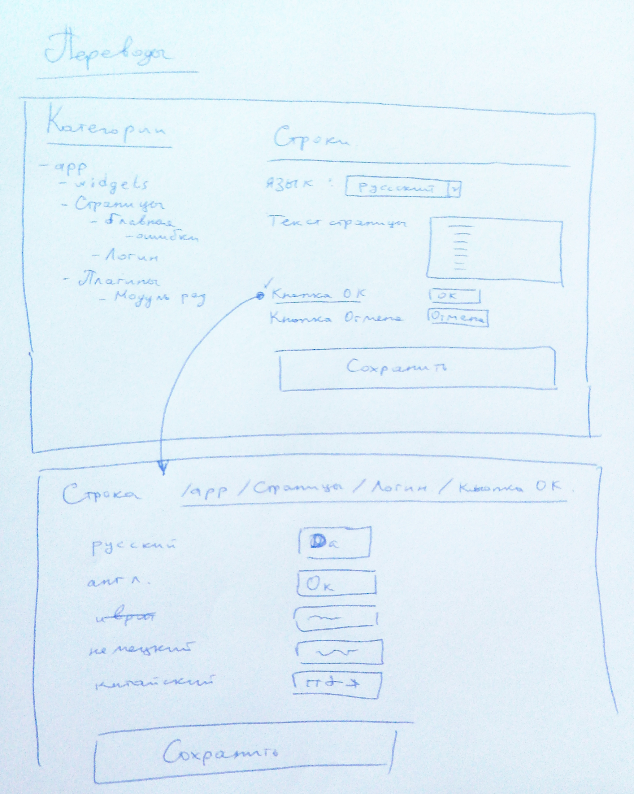

Использование языков
====================

Описывает систему использования нескольких языков, редактирование строковых переменных,
процедуру определения языка пользователя и переключения языка.

# Терминология

- *Идентификатор языка* - идентификатор таблицы `languages.id`.
- *Код языка* - переменная которая хранится в `Yii::$app->language`.
- *Язык по умолчанию* - *идентификатор языка*, который используется если не определен язык по интеллектуальному алгоритму и
тот, который используется в поле основной таблицы при переводе списков (см. Переводы списков)
и в основном поле при переводе полей (см. Переводы полей) `Yii::$app->params['languages']['defaultId']`

### Таблица `languages`

id - int - autoincrement
name - string - Название языка
code - varchar(16)
...

Которая содержит еще и таблицу с переводами языков `languages_translation` (см. Перевод списков)

# Описание

Что переводим:
 - строки на странице
 - картинки на странцие
 - ошибочные сообщения в коде
 - списки, например список городов, список языков, список групп пользователей

Используемый язык кабинета для пользователя сохраняется в поле `user.language_id`.

Для приложения переменная языка хранится в переменной сессии `$_SESSION['app.language']`.

Структура таблицы `languages`:
- id - int - идентификатор языка
- name - varchar(255) - Название языка
- code - varchar(16) - код языка который используется в переменной `Yii::$app->language`

Для того чтобы язык приложения всегда был установлен верно, то есть чтобы язык пользователя
был установлен соответствующий язык приложения, то есть `Yii::$app->language`, вешаем функцию
на событие `\yii\base\Application::EVENT_BEFORE_REQUEST` таким образом:

файл `/frontend/config/main.php`
```php
return [
    // ...
	'on ' . \yii\base\Application::EVENT_BEFORE_REQUEST => function($event) {
		$language = null;
		if (Yii::$app->user->isGuest) {
			// Гость
			$language = Yii::$app->session->get('app.language', null);
			if (is_null($language)) {
				$language = \app\services\Language::getGoodLanguage();
				Yii::$app->session->set('app.language', $language);
			}
		} else {
			/** @var \common\models\User $user */
			$user = Yii::$app->user->identity;
			if ($user->language_id) {
				$language = $user->language_id;
			} else {
				$language = \app\services\Language::getGoodLanguage();
				$user->language_id = $language;
				$user->save(false, ['language_id']);
			}
		}
		Yii::$app->language = \app\services\Language::convertLanguageIdToAppLanguage($language);
		// ...
	},
    // ...
];
```

# Переводы списков

Для перевода списков используем следующую стандартизированную структуру:
Таблица исходных значений:
- id - int - идентификатор строки
- name - varchar(255) - название строки, будет использовано если не будет найдено значения на соответствующем языке
- ... - другие поля
Например она называется `languages` (<name>)

Соответственно для нее должна быть таблица с переводами: `<name>_translation`
- id - int - идентификатор строки
- parent_id - int - идентификатор переводимой строки (languages.id)
- name - varchar(255) - название строки
- language - varchar(16) - код языка который используется в переменной `Yii::$app->language`
- ... - другие поля

# Переводы картинок

Переводы картинок хранится в строковых переменных. Нет строго определнного как должны именоваться файлы и где храниться, 
но рекомендается следующим образом:

Например есть картинка в которой на русском написано "Логин"
`/images/page/login.jpg`

на английском она будет
`/images/page/login_<Идентификатор языка>.jpg`


# Переводы полей

Всего используется два вида полей для переводов:
- Строки
- Картинки

Для этого можно расширить Класс ActiveRecord чтобы обращаясь к переменной возвращалося переведенное значение. Например:

```php
// в переменную $comment будет помещен коментарий уже переведенный на язык который используется в системе
$comment = $transation->coment;
```

Пример класса от которого нужно наследоваться чтобы поля были переводимыми:
```php
class Transaction extends TranslatedActiveRecord
{
    return translationFields()
    {
        return ['coment'];
    }

    // ...
}
```

Промежуточный класс:

```php
use yii\db\ActiveRecord;
use yii\helpers\ArrayHelper;

class TranslatedActiveRecord extends ActiveRecord
{
    public $_translationFields;

    /**
     * @return array
     * Два варианта возврата:
     *
     * Такие поля используются для перевода как строки:
     * [
     *     '<Название поля для перевода>'
     * ]
     *
     * Такие поля используются для перевода как строки и картини:
     * [
     *     'text' => [
     *          '<Название поля для перевода>',
     *          ...
     *          ],
     *     'image' => [
     *          '<Название поля для перевода>',
     *          ...
     *          ],
     * ]
     *
     */
    public function translationFields()
    {
        return [];
    }

    /**
     * Возвращает ответ на вопрос: Поле $name является полем для перевода?
     *
     * @return bool
     * true - поле является полем для перевода
     * false - поле не является полем для перевода
     */
    private function isTranslationField($name)
    {
        $fields = $this->translationFields();
        if (ArrayHelper::isAssociative($fields)) {
            $text = ArrayHelper::getValue($fields, 'text', []);
            $image = ArrayHelper::getValue($fields, 'image', []);
            return in_array($name, $text) || in_array($name, $image);
        } else {
            return in_array($name, $fields);
        }
    }

    /**
     * PHP getter magic method.
     * This method is overridden so that attributes and related objects can be accessed like properties.
     *
     * @param string $name property name
     * @throws \yii\base\InvalidParamException if relation name is wrong
     * @return mixed property value
     * @see getAttribute()
     */
    public function __get($name)
    {
        if ($this->translationFields()) {
            if ($this->isTranslationField($name)) {
                return $this->__getTranslated($name);
            }
        }
        return parent::__get($name);
    }

    public function __getTranslated($name)
    {
        if (Language::isDefault()) {
            return $this->$name;
        } else {
            $fieldNameTranslation = $name . '_translation';
            $value = $this->$fieldNameTranslation;
            if (is_null($value)) {
                return $this->$name;
            } else {
                if ($value == '') {
                    return $this->$name;
                } else {
                    $data = json_decode($value);
                    foreach ($data as $row) {
                        if (Language::getLanguageId() == $row[0]) {
                            return $row[1];
                        }
                    }
                    return $this->$name;
                }
            }
        }
    }

    /**
     * PHP getter magic method.
     * This method is overridden so that attributes and related objects can be accessed like properties.
     *
     * @param string $name property name
     * @throws \yii\base\InvalidParamException if relation name is wrong
     * @return mixed property value
     * @see getAttribute()
     */
    public function __set($name, $value)
    {
        if ($this->translationFields()) {
            if ($this->isTranslationField($name)) {
                return $this->__setTranslated($name, $value);
            }
        }
        return parent::__set($name, $value);
    }

    public function __setTranslated($name, $value)
    {
        if (Language::isDefault()) {
            $this->$name = $value;
        } else {
            $fieldNameTranslation = $name . '_translation';
            $value = $this->$fieldNameTranslation;
            if (is_null($value)) {
                $value = [[Language::getLanguageId(), $value]];
            } else {
                if ($value == '') {
                    $value = [[Language::getLanguageId(), $value]];
                } else {
                    $data = json_decode($value);
                    $isSet = false;
                    for ($i = 0; $i < count($data); $i++) {
                        $row = &$data[$i];
                        if (Language::getLanguageId() == $row[0]) {
                            $row[1] = $value;
                            $isSet = true;
                            break;
                        }
                    }
                    if (!$isSet) {
                        $data[] = [Language::getLanguageId(), $value];
                    }
                    $this->$fieldNameTranslation = json_encode($data);
                }
            }
        }
    }
}
class Language extends Object
{
    /**
     * Возвращает язык пользователя в зависимости от настроек пользователя
     *
     * @return string язык в формате таблица languages.id
     */
    public static function getGoodLanguage()
    {

    }

    /**
     * Преобразовывает languages.id в Yii::$app->language
     *
     * @return string
     */
    public static function convertLanguageIdToAppLanguage($lid)
    {
        return 'ru';
    }

    public static function isDefault()
    {
        return \Yii::$app->language == \app\services\Language::convertLanguageIdToAppLanguage(self::getDefaultId());
    }

    public static function getLanguageId()
    {
        $v = \Yii::$app->session->get('app.language', null);
        if (is_null($v)) return self::getDefaultId();

        return $v;
    }

    public static function getDefaultId()
    {
        $v = ArrayHelper::getValue(\Yii::$app->params, 'languages.defaultId');
        if (is_null($v)) {
            throw new \Exception('Не указана переменная \Yii::$app->params[\'languages\'][\'defaultId\']');
        }

        return $v;
    }
}
```

## Строки

Применяется когда необходимо перевести поле таблицы, например поле `transaction.coment`.

Для этого поле создается доп поле `<name>_translation`, где `<name>` - имя исходного поля. Тип данных TEXT.
Формат хранения данных: JSON
~~~
[
    [
        <Идентификатор языка>, '<текст>'
    ],
    ...
]
~~~

Если в приложении используется язык по умолчанию `Language::isDefault()` то берется поле `<name>` иначе испольуется поле `<name>_translation`

## Картинки

Используется таже технология что и для строк, при чем когда производится редактирование и управление переводами картинок то используется еще менеджер картинок.
Путь для картинок переводов: `/frontend/web/images/translation/<Идентификатор языка>/<Идентификатор картинки>.ext`
Сохраняется файл с именем 00000000012.jpg, дле 12 - это идентификатор строки `source_message.id`

# Хранение переводов

Для хранения языков используется
 класс [yii\i18n\GettextMessageSource](http://www.yiiframework.com/doc-2.0/yii-i18n-gettextmessagesource.html) и
  хранятся они в файлах PO/MO.

Исходный файл имеет расширение `*.po`. Cкомпилированный языковый файл имеет расширение `*.mo`.
Для их редактирования есть программа [Poedit](https://poedit.net/).

Для хранения можно использовать также и [yii\i18n\DbMessageSource](http://www.yiiframework.com/doc-2.0/yii-i18n-dbmessagesource.html)
при этом можно использовать отдельную базу данных. И еще сразу закешировать эти строки в кеше.

Для хранения используются две таблицы:

~~~
CREATE TABLE source_message (
    id INTEGER PRIMARY KEY AUTO_INCREMENT,
    category VARCHAR(32),
    message TEXT
);

CREATE TABLE message (
    id INTEGER,
    language VARCHAR(16),
    translation TEXT,
    PRIMARY KEY (id, language),
    CONSTRAINT fk_message_source_message FOREIGN KEY (id)
        REFERENCES source_message (id) ON DELETE CASCADE ON UPDATE RESTRICT
);
~~~


# Редактирование переводов

Для этого создается роль переводчика в Аднинистративной панели и функции для управления строками перевода.



Если сроковая переменная - это картинка, то дается возможность загрузить файл.