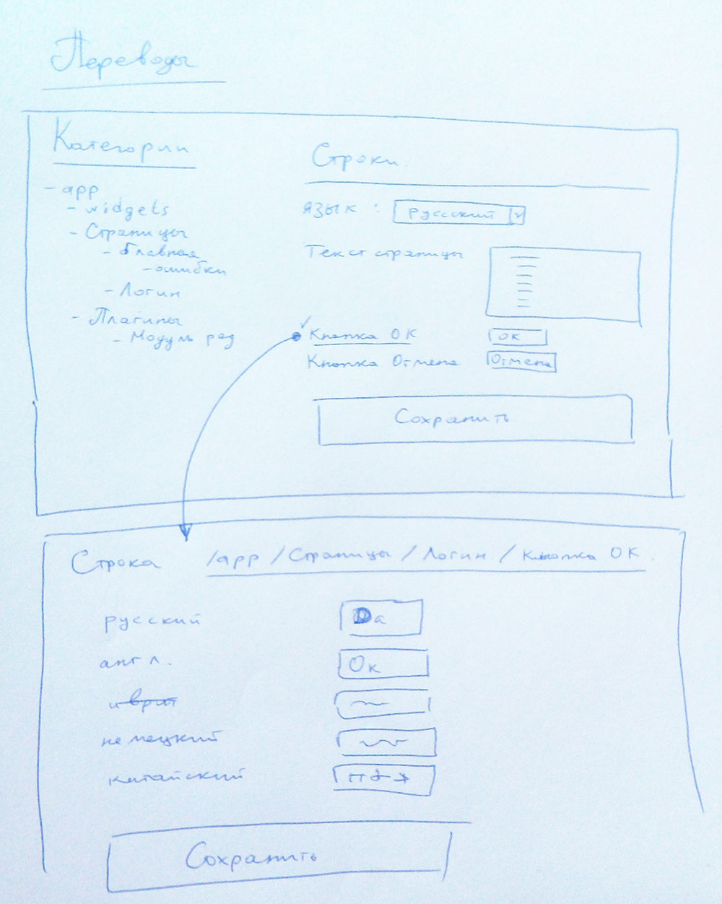

Использование языков
====================

Описывает систему использования нескольких языков, редактирование строковых переменных,
процедуру определения языка пользователя и переключения языка.

# Терминология

- *Идентификатор Языка* - наш идентификатор таблицы `languages.id`.
- *Код Языка* - переменная которая хранится в `Yii::$app->language` по стардарту [ISO 639-1](https://ru.wikipedia.org/wiki/ISO_639).
- *Язык по умолчанию* - *код языка*, который используется если не определен язык по интеллектуальному алгоритму и
тот, который используется в поле основной таблицы при переводе списков (см. Переводы списков)
и в основном поле при переводе полей (см. Переводы полей) `Yii::$app->sourceLanguage`

# Глобальная идеология Интернализации (i18n) и Локализации

Для указания *Кода языка* мы используем двухбуквенный код по стардарту [ISO 639-1](https://ru.wikipedia.org/wiki/ISO_639).
В приложении если необходимо в коде установить глабальный язык приложения это делается следующей командой:
```php
 // ...
 Yii::$app->language = 'ru';
 // ...
```

Устанавливается язык в конфигурации: файл `main.php`
```php
return [
    // Язык "используемый в системе" на которой надодится интерфейс пользователя с которым общается наша система
    'language' => 'ru'

    // Язык "используемый по умолчанию" если не нашлось перевода на язык "используемый в системе"
    'sourceLanguage' => 'ru'
];
```

Стратегия сооставления пользовательских предпочтений и использыемых в системе хранится в `Yii::$app->params['languageService']['strategy']`
```php
return [
    'languageService' => [
        'strategy' => [
            'ru' => ['ru', 'be', 'ky', 'ab', 'mo', 'et', 'lv', 'uk'],
            'en' => ['en', 'de', 'da']
        ],
        // ...
    ]
    // ...
];
```


Список используемых языков хранится в таблице `languages`.

### Таблица `languages`

- id - int - autoincrement
- name - string - Название языка
- code - varchar(16) - *Код Языка*, который используется в переменной `Yii::$app->language`
...

Которая содержит еще и таблицу с переводами языков `languages_translation` (см. Перевод списков)

# Описание

Что переводим:
 - строки на странице
 - картинки на странцие
 - ошибочные сообщения в коде
 - списки, например список городов, список языков, список групп пользователей

Используемый язык итерфейса для пользователя сохраняется в поле `user.language_id` и указывается как *Код Языка*.

Для приложения переменная языка хранится в переменной сессии `$_SESSION['app.language']`.

Для того чтобы язык приложения всегда был установлен верно, то есть чтобы язык пользователя
был установлен соответствующий язык приложения, то есть `Yii::$app->language`, вешаем функцию
на событие `\yii\base\Application::EVENT_BEFORE_REQUEST`, которая имеет следующий алгоритм:
- Если гость в системе, то язак системы устанавливается из переменной сессии `Yii::$app->session->get('app.language', null)`,
если переменная в сессии не установлена, то используется *Алгоритм Подбора Подходящего Языка*, и он же сохраняется в сессию.
- Если в системе Авторизованный пользователь, то берем язык который у него указан в настройках аккаунта, опять же если не указан то
 используется *Алгоритм Подбора Подходящего Языка*.

таким образом:

файл `/frontend/config/main.php`
```php
return [
    // ...
	'on ' . \yii\base\Application::EVENT_BEFORE_REQUEST => function($event) {
		$language = null;
		if (Yii::$app->user->isGuest) {
			// Гость
			$language = Yii::$app->session->get('app.language', null);
			if (is_null($language)) {
				$language = \common\components\LanguageService::getBestLanguage();
				Yii::$app->session->set('app.language', $language);
			}
		} else {
			/** @var \common\models\User $user */
			$user = Yii::$app->user->identity;
            if ($user->hasProperty('language_id')) {
				if ($user->language_id) {
					$language = $user->language_id;
				} else {
					$language = \common\components\LanguageService::getBestLanguage();
				}
			} else {
                $language = \common\components\LanguageService::getBestLanguage();
			}
		}
		Yii::$app->language = $language;
		// ...
	},
    // ...
];
```


# Переводы списков

Для перевода списков используем следующую стандартизированную структуру:
Таблица исходных значений:
- id - int - идентификатор строки
- name - varchar(255) - название строки, будет использовано если не будет найдено значения на соответствующем языке
- ... - другие поля
Например она называется `languages` (<name>)

Соответственно для нее должна быть таблица с переводами: `<name>_translation`
- id - int - идентификатор строки
- parent_id - int - идентификатор переводимой строки (languages.id)
- name - varchar(255) - название строки
- language - varchar(16) - код языка который используется в переменной `Yii::$app->language`
- ... - другие поля

# Переводы картинок

Переводы картинок хранится в строковых переменных.
см. раздел [Картинки](#Картинки)


# Переводы полей

Всего используется два вида полей для переводов:
- Строки
- Картинки

Для этого можно расширить Класс `ActiveRecord` чтобы обращаясь к переменной возвращалось переведенное значение. Например:

```php
// в переменную $comment будет помещен коментарий уже переведенный на язык который используется в системе
$comment = $transaсtion->coment;
```

Пример класса от которого нужно наследоваться чтобы поля были переводимыми:
```php
class Transaction extends TranslatedActiveRecord
{
    return translationFields()
    {
        return ['coment'];
    }

    // ...
}
```

Промежуточный класс:

```php
use yii\db\ActiveRecord;
use yii\helpers\ArrayHelper;

class TranslatedActiveRecord extends ActiveRecord
{
    /**
     * @return array
     * Два варианта возврата:
     *
     * Такие поля используются для перевода как строки:
     * [
     *     '<Название поля для перевода>'
     * ]
     *
     * Такие поля используются для перевода как строки и картини:
     * [
     *     'text' => [
     *          '<Название поля для перевода>',
     *          ...
     *          ],
     *     'image' => [
     *          '<Название поля для перевода>',
     *          ...
     *          ],
     * ]
     *
     */
    public function translationFields()
    {
        return [];
    }

    /**
     * Возвращает ответ на вопрос: Поле $name является полем для перевода?
     *
     * @return bool
     * true - поле является полем для перевода
     * false - поле не является полем для перевода
     */
    private function isTranslationField($name)
    {
    }

    /**
     * PHP getter magic method.
     * This method is overridden so that attributes and related objects can be accessed like properties.
     *
     * @param string $name property name
     * @throws \yii\base\InvalidParamException if relation name is wrong
     * @return mixed property value
     * @see getAttribute()
     */
    public function __get($name)
    {
    }

    /**
     * Возвращает поле в языке который установлен в приложении
     * Если оно Текущий язык в системе является языком в который принят по умолчанияю то возвращается значение поля $name
     * иначе оно выбирается из поля `<$name>_translation`
     *
     * @param $name
     * @return mixed
     */
    public function __getTranslated($name)
    {
    }

    /**
     * PHP getter magic method.
     * This method is overridden so that attributes and related objects can be accessed like properties.
     *
     * @param string $name property name
     * @throws \yii\base\InvalidParamException if relation name is wrong
     * @return mixed property value
     * @see getAttribute()
     */
    public function __set($name, $value)
    {
    }

    public function __setTranslated($name, $value)
    {
    }
}
```

Чтобы задать в поле сразу несколько вариантов перевода, при добавлении записи то это можно сделать так
```php
$t = new Translation();
$t->comment = [
    'ru' => 'Перевод',
    'en' => 'Transaction',
];
$t->save();
```

## Строки

Применяется когда необходимо перевести поле таблицы, например поле `transaction.coment`.

Для этого поле создается доп поле `<name>_translation`, где `<name>` - имя исходного поля. Тип данных TEXT.
Формат хранения данных: JSON
~~~
[
    [
        <Код Языка>, '<текст>'
    ],
    ...
]
~~~

Если в приложении используется язык по умолчанию `\common\components\LanguageService::isDefault()` то берется поле `<name>` иначе испольуется поле `<name>_translation`

## Картинки

Используется таже технология что и для строк, при чем когда производится редактирование и управление переводами картинок то используется еще менеджер картинок.
Путь для картинок переводов: `/frontend/web/images/translation/<Код Языка>/<Идентификатор картинки>.ext`
Сохраняется файл с именем 00000000012.jpg, дле 12 - это идентификатор строки `source_message.id`

Пример: Есть таблица заказа и в ней поле `image` которое переводится. Это значит что в базе будет сущкствовать поле `image` и `image_translation`
Класс заказа должен быть создан от родительского `\common\base\TranslatedActiveRecord` и укзать в нем
```php
class Order extend \common\base\TranslatedActiveRecord
{
    public function translationFields()
    {
        return ['image'];
    }
}
```

и чтобы получить в представлении (шаблоне) переведенную картинку, то нужно сделать это так:
~~~
image ?>" width="100">
~~~
Если надо выдать ее с полным путем, то так
~~~
image, true) ?>" width="100">
~~~

# Хранение переводов

Для хранения используется  [yii\i18n\DbMessageSource](http://www.yiiframework.com/doc-2.0/yii-i18n-dbmessagesource.html)
при этом можно использовать отдельную базу данных. И еще сразу закешировать эти строки в кеше.

Для хранения используются две таблицы:

~~~
CREATE TABLE source_message (
    id INTEGER PRIMARY KEY AUTO_INCREMENT,
    category VARCHAR(32),
    message TEXT
);

CREATE TABLE message (
    id INTEGER,
    language VARCHAR(16),
    translation TEXT,
    PRIMARY KEY (id, language),
    CONSTRAINT fk_message_source_message FOREIGN KEY (id)
        REFERENCES source_message (id) ON DELETE CASCADE ON UPDATE RESTRICT
);
~~~

# Категории переводов

Каждая категория в Yii может храниться в разных форматах. Указывается это в файле `main.php`.
```
return [
    // ...
    'components' => [
		// ...
        // Языки
        'i18n' => [
            'translations' => [
	            'menu*' => [
		            'class' => 'yii\i18n\PhpMessageSource',
		            'basePath' => '@app/messages',
		            'sourceLanguage' => 'en-US',
		            'fileMap' => [
			            'menu' => 'menu.php'
		            ],
	            ],
                // ...
            ],
        ],
    ],
    // ...
];
```

## Переменные в PhpMessageSource

basePath -
sourceLanguage - Язык используемый в *ключах* к переменным.

## Способы обозначения категории в индексе

`menu*` - Это значит что ...
`menu` - Это значит что ...


# Редактирование переводов

Для этого создается роль переводчика в Аднинистративной панели и функции для управления строками перевода.



Если сроковая переменная - это картинка, то дается возможность загрузить файл.