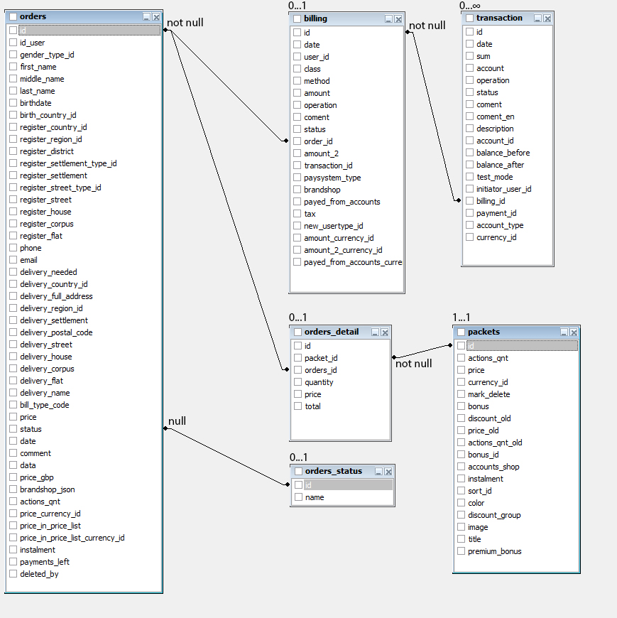

Заказы
======

Здесь хранятся покупки пользователя.

Связь с таблицей `billing` является один-к-одному. `billing.order_id = orders.id`

Для одной транзакции возможно две операции снятия с кошелька и одна начисления, как при переводе денег от одного
пользователя другому.

## Статусы

- 1 -
- 3 -
- 5 - отмененная

