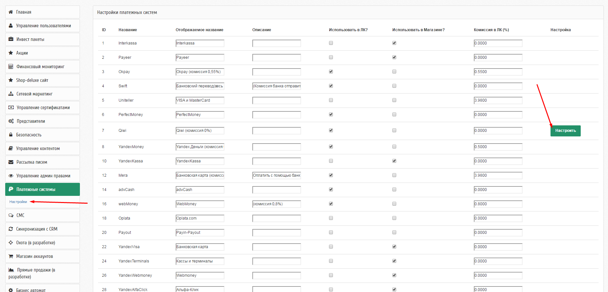

Платежные системы
=================

Информация обо всех используемых в Инвестиционном приложении платежных системах хранится в таблице `payment_systems`.

В поле data сохраняется конфиг платежной системы.

# Qiwi

Для Qiwi можно задать несколько платежных аккаунтов и менять их в блоке адмнистративной панели.
Задаются они в файле `/common/config/params` так:

```php
return [
    // ...
	'qiwiAccounts' => [
		'+79295630865',
		'+79295630866',
        // ...
	],
    // ...
];
```

Для выбора использующегося можно пользоваться настройками в административном модуле:




