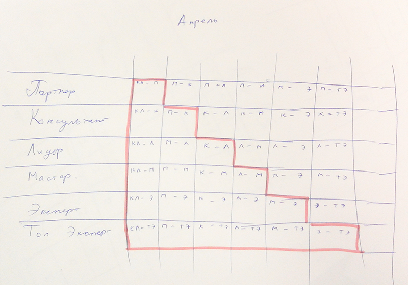

Статистика по типам пользователей по месяцам
============================================

Алгоритм:

Вывожу таблицу с мин месяца за весь периуд до последнего завершенного на сейчас.

Выводится таблица:

где в последнем столбце выводится общая сумма пользователей на конец месяца.

Если ячейка не заполнена то начинает производиться расчет онлайн, по клеточкам.

Вызывается скрипт `site/index_ajax_types`
и расчитывает на каждую ячейку таблицы число переходов из одного статуса в другой.
