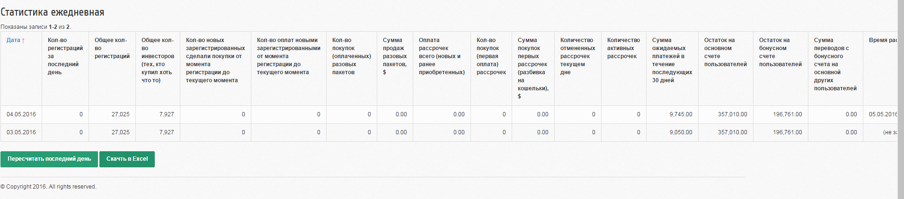

Статистика по дням
==================

# Просмотр

В административном модуле статистика отображается на странице `/statistic/every-day`  отображается статистика по дням.

# Таблица

Для хранения статистики используется таблица `stat_every_day`.
- id - int - идентификатор
- date - date - дата расчитанных данных
- c - int - Кол-во регистраций за последний день
- d - int - Общее кол-во регистраций
- e - int - Общее кол-во инвесторов (тех, кто купил хоть что то)
- f - int - Кол-во новых зарегистрированных сделали покупки от момента регистрации до текущего момента
- g - int - Кол-во оплат новыми зарегистрированными от момента регистрации до текущего момента
- i - int - Кол-во покупок (оплаченных) разовых пакетов
- j - float - Сумма продаж разовых пакетов, $
- k - float - Оплата рассрочек всего (новых и ранее приобретенных)
- l - int - Кол-во покупок (первая оплата) рассрочек
- m - float - Сумма покупок первых рассрочек (разбивка на кошельки), $
- n - int - Количество отмененных рассрочек текущем дне
- o - int - Количество активных рассрочек
- p - float - Сумма ожидаемых платежей в течение последующих 30 дней
- s - float - Остаток на основном счете пользователей
- t - float - Остаток на бонусном счете пользователей
- u - float - Сумма переводов с бонусного счета на основной других пользователей
- time_calc - int - время когда производился расчет

# Расчет

На каждый день зпускается скрипт консольный `./yii statistic/every-day` который расчитывает статистику за вчера.
Поэтому его желательно запускать с утра часов в 6.
Если запись уже есть то будет выдана ошибка.

Что бы пересчитать значения, то это можно сделать из админки на странице просмотра статистики, нажав на кнопку "Пересчитать последний день".