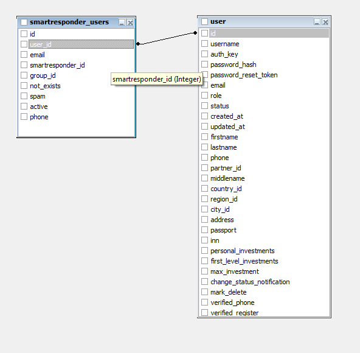

SmartResponder
==============

Сервис рассылки писем.

Для работы с ним используется [API](https://smartresponder.ru/l_ru/api.html).

У пользователя есть поле отвечающее за то какое поле отвечает за ID smartresponder. За это отвечает таблица
`smartresponder_users`.

Таблица `smartresponder_history` отвечает за сохранение истории рассылки.



<table>
<tr>
<td>id</td><td>INT</td><td></td></tr>
    <td>user_id</td><td>INT</td><td>Идентификатор пользователя</td></tr>
    <td>email</td><td>VARCHAR(255)</td><td></td></tr>
    <td>smartresponder_id</td><td>INT</td><td>Идентификатор smartresponder</td></tr>
    <td>group_id</td><td>INT</td><td></td></tr>
    <td>not_exists</td><td>INT</td><td></td></tr>
    <td>spam</td><td>INT</td><td></td></tr>
    <td>active</td><td>INT</td><td></td></tr>
    <td>phone</td><td>VARCHAR(255)</td><td></td></tr>
</table>

# Обслуживание

## save

Для того чтобы сохранить данные из SmartResponder
Нужно в консоли выполнить следующую команду:

~~~
php yii smart-responder/save
~~~

Эта процедура сохранит все данные в файл `@console/migrations/smartresponder/dump_<time()>.php` то есть например в `/console/migrations/smartresponder/dump_1463658221.php`.
сохраняемые поля:
- id
- email
- first_name
- middle_name
- country_id
- city
- sex

Если поле пустое то оно не будет указано в файле, то есть массив не нормализованный для оптимизации длины файла

## update-country

Для того чтобы обновить данные из нашей базы в SmartResponder нужно в консоли выполнить следующую команду:

~~~
php yii smart-responder/update-country
~~~

Она обновит страну и город для пользователя.

## restore

Восстанавливает дамп

~~~
php yii smart-responder/restore file=dump_1463669854.php
~~~

# Использование

Используется в `/vendor/eventer/Eventer.php`:

```php
class Eventer extends Module implements BootstrapInterface
{
    /**
     * @param \yii\base\Application $app
     */
    public function bootstrap($app)
    {
        // При добавлении нового пользователя
        Event::on(User::className(), User::EVENT_AFTER_INSERT, function ($event) {
            // ...
			SmartresponderUser::new_active_user($user->id,$user->email,$user->phone);
            // ...
        });
        // ...
    }
}
```

