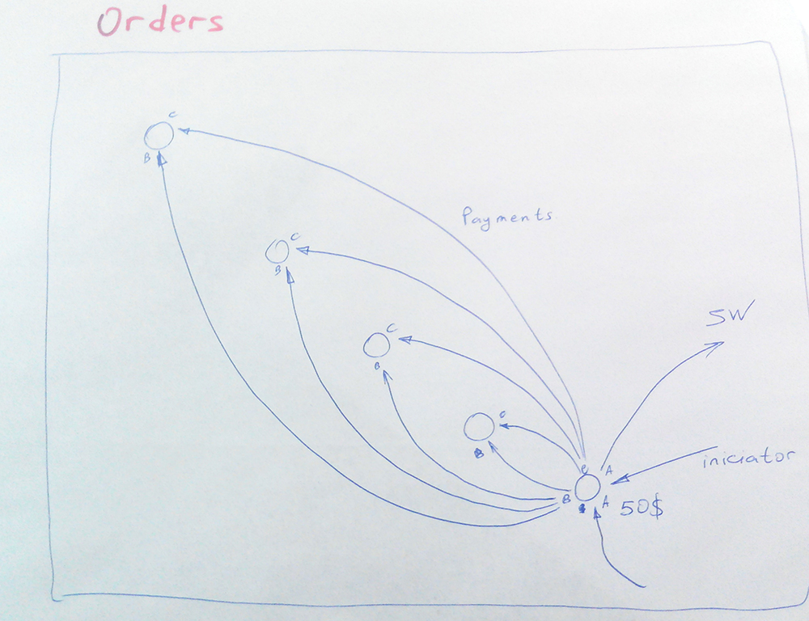

# Payments

Содержит отчисления с реферальной системы

таблица payments

- *from_account_id* - идентификатор кошелька с которого производилось списание средств
- *to_account_id* - идентификатор кошелька на который срдества начислялись
- *status* -
- *type* - тип отчисления (если lvl=1, то type=1; если lvl>1, то type=2)
- *sum* - сумма перечисления
- *date* - время перевода
- *percent* - % по которому вычислялись реферальные начисления
- *initiator_user_id* - идентификатор пользователя, который и явился инициатором этого реферального отчисления
- *order_id* - заказ в который и входит это реферальное отчисление.
- *lvl* - уровень с которого происходят отчисления

