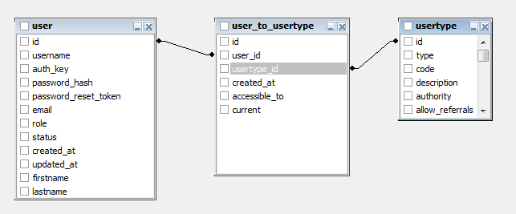

Пользователи
============

Для организации типа пользователя используется связь многие-ко-многим
на основе таблиц: `user`, `user_to_usertype`, `usertype`.

В таблице `user_to_usertype` содержится история смены типов. В поле `created_at` содержится время перехода в этот тип.
В поле `current` стоит флаг отвечающий на вопрос "Является ли эта запись текущей". То есть:
 - если `current=0`, то это запись истории
 - если `current=1`, то это запись указывающая текущий тип пользователя

# Таблица `user`

Поле `created_at` содержит время регистрации пользователя.

`username` - почта пользователя, если пользователь подтвердил свою почту, если не подтвердил, то поле равно ''.

`verified_email` - флаг содержит ответ на вопрос "Подтвердил ли пользователь email?"
- 0 - не подтвердил
- 1 - подтвердил

`verified_email_code` - содержит код для подтверждения `email`.

`email` - email пользователя для подтверждения.

# Таблица `user_to_usertype`

- `accessible_to` - int - Станислав, Святослав, Эдуард не в курсе,
- `created_at_to` - int - время кога пользователь перешел в этот статус
- `current` - int - флаг отвечающий на вопрос "Этот статус текущий сейчас у пользователя?" - может быть = 0 или 1
- `user_id` - int - идентификатор пользователя `user`.`id`
- `usertype_id` - int - тип пользователя `usertype`.`id`

